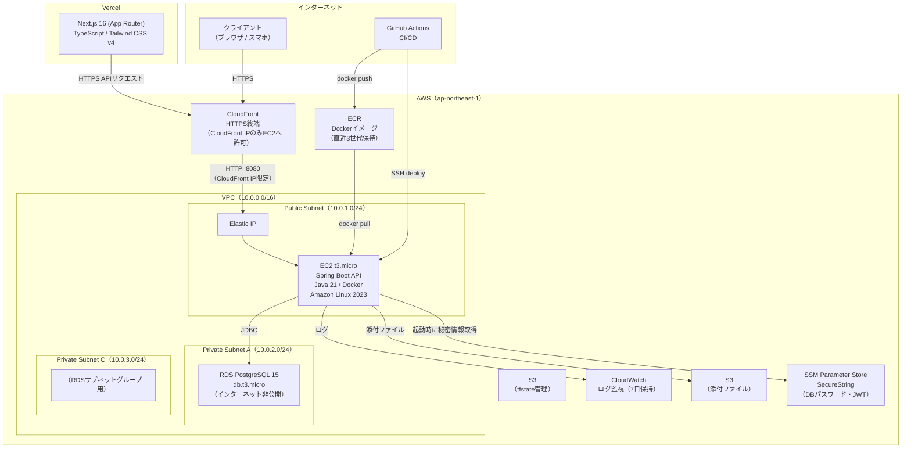
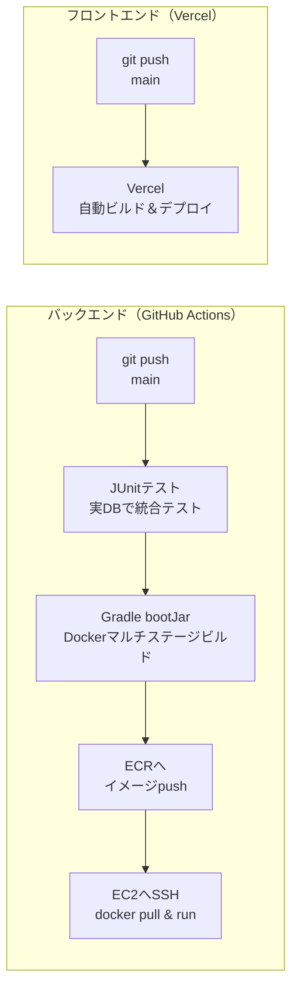
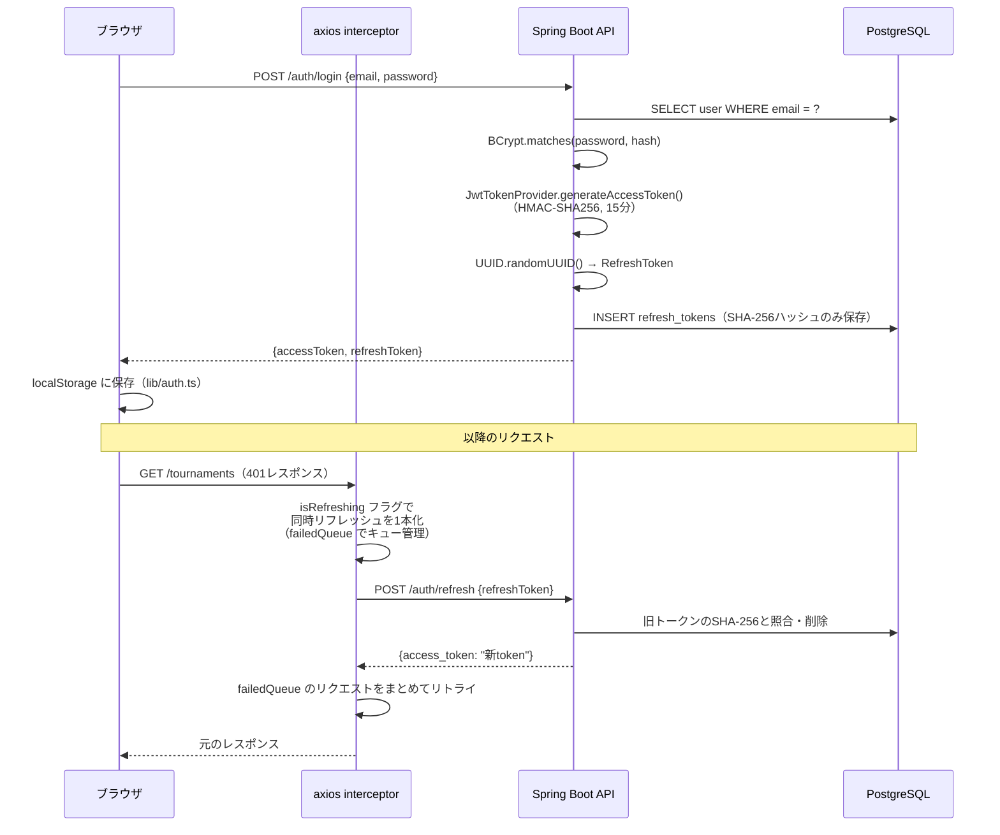

# Maestro Tennis — テニス大会管理SaaS（ポートフォリオ用ショーケース）

> **本番リポジトリは private です。このリポジトリは面接・コーディング審査用に代表的なコードを抽出したものです。**

---

## デモ

| | |
|---|---|
| **管理画面** | https://tennis-oop-front.vercel.app/login |
| **公開ビュー（認証不要）** | https://tennis-oop-front.vercel.app/view/2a061fe5-31ff-4ca2-b648-d8ed87891464 |

**デモ用アカウント（管理画面ログイン）**

```
Email:    demo@example.com
Password: password123
```

> デモ用アカウントです。データは随時リセットされます。

---

## ① プロジェクト概要・提供価値

テニス大会の試合進行をデジタル化し、運営スタッフの負担を軽減するWebアプリケーション。大会主催者がオーダーオブプレイ（試合順）・ドロー表・スコアをリアルタイムで管理し、選手・観客は認証不要の公開URLからいつでも確認できる。

現在ベータ版として練習試合の運営で実際に使用されています。

**解決した課題:**

- 紙・手書きのボードで試合順を管理しており、変更のたびに書き直しが発生する
- 試合の進行状況をリアルタイムで選手・観客に伝える手段がない
- 複数のスタッフが同じ情報を参照・更新できず、情報の齟齬が起きやすい

**ターゲットユーザーとロール:**

| ロール | 権限 |
|---|---|
| `owner` | 大会の作成・削除・全操作・ロール変更 |
| `leader` | ドロー管理・OOP操作・staff/viewer招待 |
| `staff` | OOP操作・スコア入力 |
| `viewer` | 管理画面の閲覧のみ |
| 選手・観客 | 認証不要。公開URLから閲覧のみ |

**主な機能:**

| 機能 | 概要 |
|---|---|
| 大会管理 | 大会の作成・編集・削除・スタッフ招待・ロール管理 |
| カテゴリ設定 | 男子シングルス・女子ダブルスなど大会独自のカテゴリを設定 |
| コート管理 | 使用するコートの登録・順番設定 |
| 選手・チーム管理 | 選手・チーム・ペアのマスター登録 / CSVインポート |
| OOP管理 | 試合の追加・ドラッグ＆ドロップによる順番変更・コート間移動 |
| ステータス管理 | 待機 / 進行中 / 中断（理由付き）/ 完了 の切り替え |
| スコア入力 | セットスコアのリアルタイム入力 |
| ドロー表管理 | シングルエリミネーション / ラウンドロビン / 団体戦 の3形式 |
| 試合要項管理 | セクション入力・添付ファイルアップロード（S3） |
| 公開URL | 認証不要の閲覧専用URL（share_token）+ QRコード |

---

## ② アーキテクチャ図

### システム全体



> **設計意図:** VercelからEC2へHTTPで直接通信するとブラウザのMixed Content制限でブロックされるため、CloudFrontをHTTPS終端として配置。ALBを使わずCloudFront直結にしているのはコスト最適化のため（ALBは最低$20/月、CloudFrontはほぼ無料）。EC2のポート8080はCloudFrontのマネージドプレフィックスリストのみに制限し、直接アクセスを遮断。

### CI/CDパイプライン



### 認証フロー（JWT 自前実装）



---

## ③ 技術スタックと各選定理由

| レイヤ | 技術 | 選定理由 |
|---|---|---|
| フロントエンド | **Next.js 16.2.4** (App Router) + React 19 | ファイルベースルーティング・Vercel連携による即時デプロイ・開発体験の良さ。認証が必要な管理画面のため全ページをクライアント主導で動作させており、Server Components は使用していない |
| スタイリング | **Tailwind CSS v4** | ユーティリティファーストで一貫したUI。デザイン系の外部依存なしで十分なUI品質を維持 |
| フォーム | **react-hook-form + zod v4** | バリデーションロジックをコンポーネントから分離。フォーム値の型を `z.infer` で自動推論 |
| DnD | **dnd-kit** | WAI-ARIAに準拠したアクセシブルなD&D。React 19と互換性が高い |
| バックエンド | **Spring Boot 3.3.4 + Java 21** | 型安全・DI・トランザクション管理が成熟。Java 21の仮想スレッドを将来的に活かせる |
| ORM | **MyBatis** | JOINや動的SQLを手書きで制御。JPAのN+1・Lazy Loadingを意図的に避け、クエリを完全把握できる |
| DB | **PostgreSQL 15** | JSONBカラム（試合スコア・ドロー参加者リスト）が必要。UUID型ネイティブ対応 |
| 認証 | **Spring Security + JJWT 0.12.x（自前実装）** | Spring Bootと統合が自然。OAuthなしで完結するスコープ。トークン検証ロジックを完全理解して書きたかった |
| インフラ | **AWS (EC2 + CloudFront + RDS + S3 + ECR)** | 個人開発のためコスト重視。t3.micro + 無料枠でほぼ$1/月（CloudFront費のみ）で運用 |
| IaC | **Terraform** | `destroy/apply` で環境をゼロから再現できる。シークレットはSSM Parameter Storeで管理 |
| CI/CD | **GitHub Actions（バックエンド）/ Vercel（フロントエンド）** | 無料枠内。push → JUnit（実DB）→ ECRプッシュ → EC2 SSHデプロイを1ワークフローで完結 |
| コンテナ | **Docker（マルチステージビルド）** | JDKビルドステージとJREランタイムステージを分離してイメージサイズを最小化 |
| テスト（BE） | **JUnit + MyBatis Spring Boot Test** | モックなし・実PostgreSQLでの統合テスト。スキーマ変更時の見逃しを防ぐ |
| テスト（FE） | **Jest + Testing Library / Playwright E2E** | ユニットテストと実ブラウザE2Eテストを両立 |

---

## ④ 主要機能ハイライト

### 1. ドラッグ＆ドロップ OOP 管理（dnd-kit + 楽観的更新）

[`frontend/app/tournaments/[id]/order/_hooks/useMatchDnd.ts`](frontend/app/tournaments/%5Bid%5D/order/_hooks/useMatchDnd.ts)

試合カードをコート内・コート間でドラッグ＆ドロップで移動できる。

```
ドラッグ終了
  ↓
① setCourts() でUIを即座に更新（楽観的更新）
  ↓
② Promise.all() で全試合の order / courtId を並行 PATCH
  ↓（失敗時）
③ onRollback() で fetchData() を呼び、サーバー状態に戻す
```

コート間移動では移動先・移動元の両コートの `order` を全件更新する。失敗時はサーバー状態に戻すロールバックで一貫性を保つ。

→ [`CourtBoard.tsx`](frontend/app/tournaments/%5Bid%5D/order/_components/CourtBoard.tsx) で `DndContext` を設置し、[`SortableMatch.tsx`](frontend/app/tournaments/%5Bid%5D/order/_components/SortableMatch.tsx) が `useSortable` フックで各カードをドラッグ可能にする。

### 2. JWT リフレッシュインターセプター（同時リクエスト対応）

[`frontend/lib/axios.ts`](frontend/lib/axios.ts)

401 を受けたとき、複数リクエストが同時にリフレッシュを走らせないよう `isRefreshing` フラグと `failedQueue` でキューイング。リフレッシュ成功後、キューされた全リクエストを新トークンで一括リトライする。

```typescript
// 同時401: 2本目以降はキューに積んで待機
if (isRefreshing) {
  return new Promise((resolve, reject) => {
    failedQueue.push({ resolve, reject });
  }).then((token) => {
    originalRequest.headers.Authorization = `Bearer ${token}`;
    return api(originalRequest);
  });
}
// 1本目がリフレッシュ → 成功後 processQueue() で全件リトライ
```

### 3. トーナメント表生成（シードアルゴリズム）

[`backend/src/main/java/com/tennisoop/api/draw/service/SeDrawService.java`](backend/src/main/java/com/tennisoop/api/draw/service/SeDrawService.java)

参加者数から対数計算でラウンド数を決定し、スロット（`draw_slots`）を生成。シード選手を標準的なテニストーナメント配置ルール（1番シードと2番シードが決勝まで当たらない）に従って再帰的に自動配置する。

```
参加者5人 → totalRounds = ⌈log₂(5)⌉ = 3 → スロット数8
generateSeedPositions(8): [1, 5, 3, 7, 2, 6, 4, 8]（国際標準配置）
Bye（不戦勝）は confirmSeDraw() 時に次ラウンドへ自動伝播
```

→ フロントでは [`frontend/app/tournaments/[id]/draw/_components/Bracket.tsx`](frontend/app/tournaments/%5Bid%5D/draw/_components/Bracket.tsx) がラウンドごとに CSS Grid でスロットを並べ、コネクター線を描画する。

### 4. 動的SQLによるドロー取得（MyBatis）

[`backend/src/main/resources/mapper/draw/DrawMapper.xml`](backend/src/main/resources/mapper/draw/DrawMapper.xml)

`draw_slots` に対して6テーブルのLEFT JOINを行い、選手名・ペア名・チーム名・試合スコアを1クエリで取得。MyBatisの `<sql>` タグで共通カラムリストとJOIN句を再利用し、DRYを保つ。`DrawMatchRef` 取得では3-way UNION ALLで「SE形式・RR形式・団体戦形式」の試合ソースを統一レスポンスで返す。

### 5. @Transactional と委譲パターン（トランザクション境界）

[`backend/src/main/java/com/tennisoop/api/draw/service/DrawService.java`](backend/src/main/java/com/tennisoop/api/draw/service/DrawService.java)

`DrawService` がファサードとして `@Transactional` を宣言し、`SeDrawService` / `RrDrawService` に処理を委譲。Serviceを複数クラスに分割しても1トランザクション内で完結する構造を維持。読み取り専用メソッドには `@Transactional(readOnly = true)` を付与してDB負荷を下げる。

### 6. JWT 自前実装（バックエンド）

[`backend/src/main/java/com/tennisoop/api/auth/`](backend/src/main/java/com/tennisoop/api/auth/)

| クラス | 役割 |
|---|---|
| `JwtTokenProvider` | AccessToken生成（HMAC-SHA256）・検証・クレーム取得 |
| `JwtAuthenticationFilter` | `OncePerRequestFilter`。リクエストごとにトークン検証し `SecurityContextHolder` にセット |
| `SecurityConfig` | Statelessセッション・CORS設定・公開エンドポイント定義 |
| `AuthService` | RefreshTokenをUUIDで生成 → SHA-256ハッシュでDB保存（平文非保持） |

---

## ⑤ 技術的に苦労した点 / 工夫した点 / 諦めた点

### 苦労した点

**団体戦（team_battle）の設計**

個人戦と異なりチームA vs チームBで複数の個人戦（ラバー）を行い勝敗を決める。既存の `draws` / `draw_slots` / `matches` スキーマを壊さずに団体戦を乗せるため `team_encounters` テーブルを追加。SEドロー確定時（`confirmSeDraw`）に `TeamEncounter` を生成して両スロットに紐付ける設計にし、既存のRR/SEロジックを変更せずに拡張できた。

**CloudFrontとVercelのMixed Content問題**

VercelからEC2に直接HTTPリクエストを飛ばすとブラウザのMixed Content制限でブロックされた。ALBを挟むと$20/月のコストが発生するため、CloudFrontをHTTPS終端として配置することで解決。CloudFrontのプレフィックスリストによりEC2ポート8080への直接アクセスも遮断でき、セキュリティも向上した。

**シードアルゴリズムの実装**

国際テニス連盟の標準配置ルール（1シードと2シードが決勝で対戦するよう、対角に配置）を再帰で実装。8スロット・16スロット・32スロットで実際のドロー表と突き合わせながらデバッグした。

**axios インターセプターの同時リフレッシュ問題**

AccessTokenの有効期限切れ後に複数タブや複数API呼び出しが同時に走ると、リフレッシュを重複して行いRefreshTokenが競合状態になる。`isRefreshing` フラグと `failedQueue` で同時リフレッシュを1本に絞り、成功後に全件リトライすることで解決した。

### 工夫した点

**テストを実DBで実行（統合テスト方針）**

MyBatisのSQLとSpring Securityを含む統合テストをモックなし・実PostgreSQL（GitHub Actionsのサービスコンテナ）で実行。スキーマ変更時にモック/本番の乖離でテストが通るのに本番で壊れる問題を避けた。

**Flywayによるスキーマ管理（V1〜V19）**

機能追加ごとに `ALTER TABLE` を積み上げて本番データを破壊せずスキーマを進化させた。v14以降の団体戦追加では既存テーブルへの最小限の変更にとどめた。

**Refresh Token 平文非保持**

DBにはSHA-256ハッシュのみ保存。万が一のDB漏洩時に即時悪用されることを防ぐ設計。フロントエンドの `localStorage` に RefreshToken を保持するのも XSS 対策として論点があるが、今回はシンプルな実装を優先した。

**SSM Parameter Store によるシークレット管理**

DBパスワード・JWTシークレットをTerraformで SSM（SecureString）に保存し、EC2の起動スクリプト（user_data）で取得して環境変数に展開。ハードコードされた秘密情報がどのファイルにも残らない構成にした。

### 諦めた点

- **選手ログイン・スコア入力承認フロー**: 選手自身がスコアを入力し審判が承認するフローは未実装。現在は staff 以上の権限者のみスコア入力可能
- **WebPush通知**: 試合順変更の通知機能は設計ドキュメントまで作成したが未実装（phase4予定）
- **AccessTokenの即時失効**: ログアウト後15分以内は AccessToken が有効なままになる。RefreshTokenのDB管理で実質的な被害を抑えているが、BlackListパターンは未実装
- **マルチAZ**: コスト優先でシングルAZ構成。本番商用化ではRDSのマルチAZ有効化とALB + ECS Fargate移行を推奨

---

## ディレクトリ構成

```
maestro-show/
├── README.md
├── .gitignore
│
├── backend/                             # Spring Boot API
│   ├── Dockerfile                       # マルチステージビルド（JDK builder → JRE runtime）
│   ├── build.gradle                     # 依存関係定義（Spring Boot 3.3.4 / MyBatis / JJWT / S3）
│   ├── .github/workflows/
│   │   ├── ci.yml                       # PR/push: JUnitテスト + Jacocoカバレッジ
│   │   └── deploy.yml                   # main: ECRプッシュ → EC2 SSHデプロイ
│   └── src/main/
│       ├── java/com/tennisoop/api/
│       │   ├── auth/
│       │   │   ├── JwtAuthenticationFilter.java  # OncePerRequestFilter: トークン検証・SecurityContext設定
│       │   │   ├── JwtTokenProvider.java          # HMAC-SHA256 生成・検証・クレーム取得
│       │   │   └── service/AuthService.java       # 登録・ログイン・リフレッシュ・ログアウト
│       │   ├── config/SecurityConfig.java         # Spring Security: Stateless・CORS・公開エンドポイント
│       │   └── draw/
│       │       ├── domain/Draw.java               # ドローエンティティ（SE/RR共用）
│       │       └── service/
│       │           ├── DrawService.java           # ファサード・@Transactional 境界
│       │           └── SeDrawService.java         # SE生成：スロット作成・シード配置・Bye伝播
│       └── resources/
│           ├── application.yml                    # 全値を環境変数参照（${ENV_VAR:default}）
│           ├── db/migration/V1__create_tables.sql # 初期スキーマ（V1〜V19のFlywayマイグレーション）
│           └── mapper/draw/DrawMapper.xml         # 動的SQL・6テーブルJOIN・3-way UNION ALL
│
├── frontend/                            # Next.js フロントエンド
│   ├── package.json                     # 依存関係（Next.js 16 / React 19 / dnd-kit / zod v4）
│   ├── .env.example                     # NEXT_PUBLIC_API_URL のみ
│   ├── __tests__/
│   │   ├── auth.test.ts                 # lib/auth.ts：トークン保存・取得・クリアのユニットテスト
│   │   ├── drawUtils.test.ts            # ラウンドラベル計算・スロットグルーピングのユニットテスト
│   │   ├── schemas.test.ts              # zod スキーマ（matchStatus・createDraw）のバリデーションテスト
│   │   └── Button.test.tsx              # Buttonコンポーネント：レンダリング・クリック・disabled・variant
│   ├── types/
│   │   └── api.ts                       # 全APIレスポンス型定義（50+インターフェース）
│   ├── lib/
│   │   ├── axios.ts                     # JWTリフレッシュインターセプター（failedQueue実装）
│   │   ├── auth.ts                      # localStorage トークン管理（直接アクセス禁止ルール）
│   │   ├── constants.ts                 # ドメイン値定数（ステータス・ラベル・CSSクラスマッピング）
│   │   └── endpoints.ts                 # APIエンドポイント定義（型安全なURL生成）
│   ├── components/
│   │   └── providers/AuthProvider.tsx   # 認証Context・ルートガード・ログアウト
│   └── app/tournaments/[id]/
│       ├── order/
│       │   ├── page.tsx                 # OOP管理ページ（統計カード・QRモーダル）
│       │   ├── _hooks/
│       │   │   ├── useOrder.ts          # データフェッチ・状態管理（Promise.all 並行取得）
│       │   │   └── useMatchDnd.ts       # D&D ロジック（楽観的更新・失敗時ロールバック）
│       │   └── _components/
│       │       ├── CourtBoard.tsx       # DndContext 設置・コート一覧グリッド
│       │       └── SortableMatch.tsx    # useSortable：スケジュール帯・スコア・ステータスUI
│       └── draw/
│           └── _components/
│               └── Bracket.tsx          # SEドロー表（CSSグリッド・コネクター線描画）
│
└── infra/                               # Terraform（AWS）
    ├── main.tf                          # プロバイダー・S3バックエンド
    ├── variables.tf                     # 変数定義（db_password・jwt_secret はsensitive）
    ├── vpc.tf                           # VPC・サブネット・IGW
    ├── security.tf                      # SG（EC2の:8080はCloudFront IPのみ、RDSはEC2のみ）
    ├── ec2.tf                           # EC2・EIP・IAMロール・user_data（SSMからシークレット取得）
    ├── rds.tf                           # RDS PostgreSQL 15（Private Subnet）
    ├── ecr.tf                           # ECRリポジトリ（scan_on_push・直近3世代ライフサイクル）
    ├── cloudfront.tf                    # CloudFront（キャッシュTTL=0・全HTTPメソッド許可）
    ├── ssm.tf                           # SecureString保存・IAMポリシー（スコープ限定）
    ├── s3.tf                            # 添付ファイル用S3（パブリックアクセス遮断）
    ├── cloudwatch.tf                    # ロググループ（保持期間7日）
    ├── outputs.tf                       # EC2 IP・CloudFront URL・RDSエンドポイント
    └── terraform.tfvars.example         # 変数テンプレート（terraform.tfvarsは.gitignoreで除外）
```

---

## セキュリティに関する注記

- `terraform.tfvars`（実際のDB・JWTシークレット）は `.gitignore` で除外。**このリポジトリには含まれていません**
- 認証情報はすべて GitHub Secrets / AWS SSM Parameter Store で管理
- `application.yml` の全シークレットは `${ENV_VAR}` 形式で環境変数から取得
- JWT RefreshToken はSHA-256ハッシュのみDBに保存（平文非保持）
- EC2のポート8080はCloudFrontのマネージドプレフィックスリストのみに制限
- ECRはpush時の脆弱性スキャン（`scan_on_push: true`）を有効化
- **SSH（ポート22）が `0.0.0.0/0` に開放されている** — 現状はキーペア認証のみで防御しているが、SSM Session Manager に移行してSSHポートを完全に閉じることが望ましい。コスト・複雑さとのトレードオフで現時点では未対応
